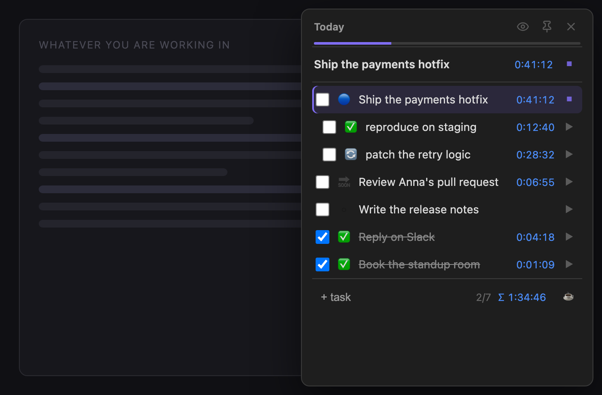
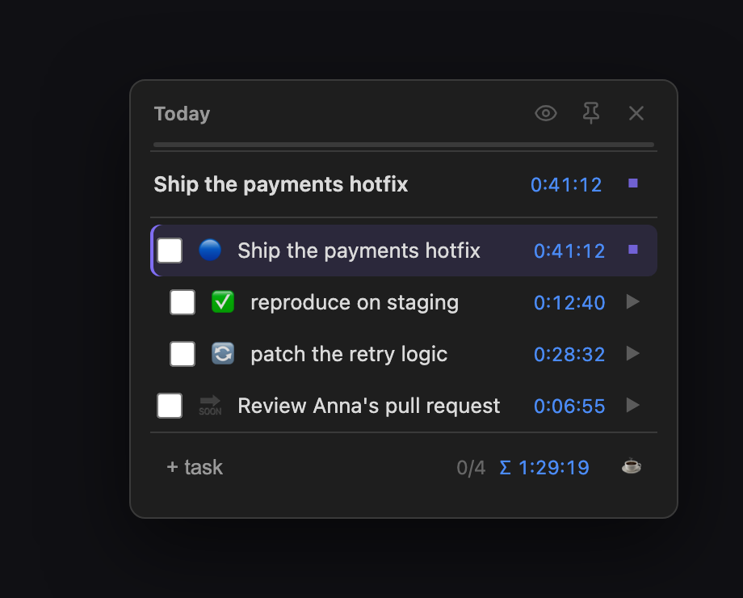
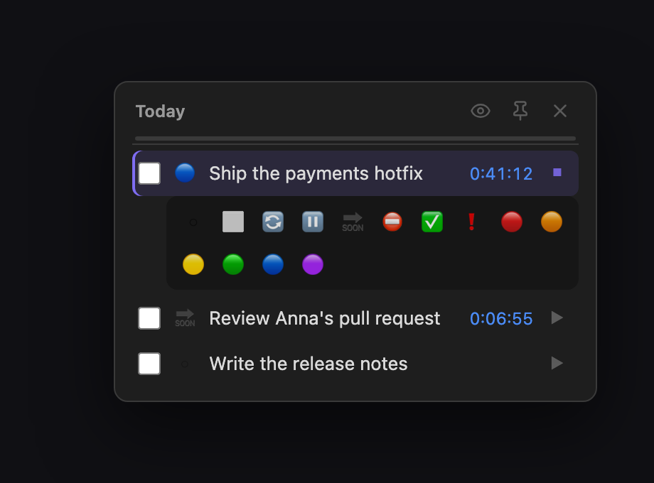
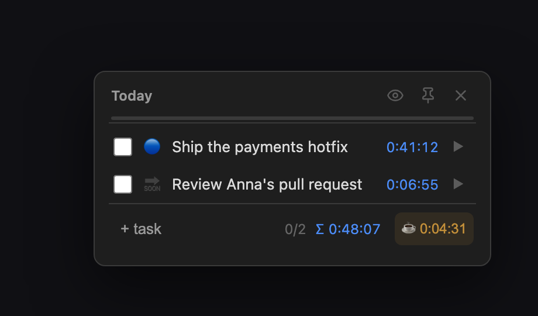
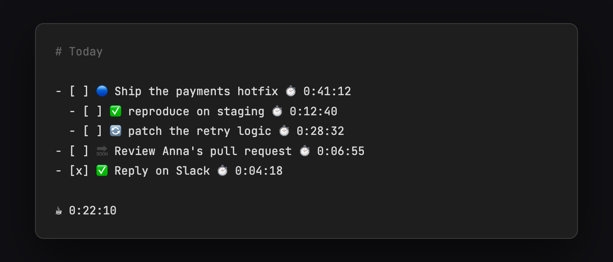

# Always-on-Top Tasks

**Always-on-Top Tasks is an Obsidian plugin that pins one note above every other window as a compact, semi-transparent overlay docked to the edge of the screen.** Every task line gets its own stopwatch: press play, work, press stop, and the elapsed time is appended to the line as ⏱️ H:MM:SS, with only one timer allowed to run at a time. A one-click emoji palette marks a line as in progress, blocked, deferred or done, and nested tasks keep their markdown indentation in the overlay. All of it is written back into the markdown file, so the time data stays plain text inside the vault and any assistant with access to the notes can read it. Desktop only, TypeScript bundled with esbuild.

<div align="center">

[](https://github.com/n23eos/obsidian-always-on-top-tasks)

</div>

## The problems this solves

**You lose the thread when several projects are open at once.** The moment a
browser, a terminal or a chat window covers your task list, the current task is
gone from your head too. The overlay stays above every other window, including
fullscreen apps, pinned to one half of the monitor — so what you are doing right
now never leaves your field of view.

**You do not know where the hours actually went.** Each task line has its own
stopwatch: press ▶, work, press ⏹. The elapsed time is appended to the line as
`⏱️ H:MM:SS`, sessions add up to the second, and only one timer can run at a
time — which is the entire point of focusing.

**Your time data is locked inside somebody else's app.** Here it is stored as
plain text inside your own vault, so anything that can read the vault can read
the numbers — including an AI agent. Ask Claude (or any assistant with access to
your notes) where last week went, and it can answer from the note itself. No
export, no API, no separate database.

**A flat checklist does not match the shape of real work.** Nested tasks keep
their markdown indentation in the overlay, and a one-click emoji palette marks
what is in progress, blocked, deferred or done — right in the line, readable in
any editor.

## What it looks like



*The overlay is docked to the right edge and floats above whatever you are
working in. It never hides behind the window you switch to.*



*While a timer runs, a sticky header keeps the current task and its ticking time
at the top, no matter how far the note is scrolled. The footer counts finished
tasks and the total time of the note.*



*One click on the status button opens an inline palette. The chosen emoji is
written into the task line, so the status is visible in plain Obsidian too.*



*The optional ☕ button stops the task timer and starts a break stopwatch. Total
break time accumulates in the note, and a long work session gets a gentle
reminder instead of a forced pomodoro stop.*



*The same note in a normal editor. No hidden database, no sidecar files — which
is what makes the data readable by other tools and by AI agents.*

<sub>Screenshots are rendered from the plugin's own `styles.css` by
[`docs/screenshots/render.mjs`](docs/screenshots/render.mjs).</sub>

## Data format

A task line is ordinary markdown: a checkbox, an optional status emoji, the
text, and the accumulated time at the end.

```markdown
- [ ] 🔵 Ship the payments hotfix ⏱️ 0:41:12
  - [ ] ✅ reproduce on staging ⏱️ 0:12:40
- [x] ✅ Reply on Slack ⏱️ 0:04:18

☕ 0:22:10
```

Statuses: ⬜ not started · 🔄 in progress · ⏸️ paused · 🔜 deferred · ⛔ blocked ·
✅ done · ❗ important · 🔴 🟠 🟡 🟢 🔵 🟣 colour labels.

The plugin stores nothing else in the note — no ids, no metadata blocks. Its
`data.json` holds only your settings and the one running timer, so that a timer
survives an Obsidian restart.

## Installation

Desktop only.

**Settings → Community plugins → Browse**, search for "Always-on-Top Tasks",
install and enable.

To install manually instead:

```bash
git clone https://github.com/n23eos/obsidian-always-on-top-tasks
cd obsidian-always-on-top-tasks
npm install
npm run build
```

Copy `manifest.json`, `main.js` and `styles.css` into
`<your vault>/.obsidian/plugins/tasks-for-focus-adhd/`, then enable the plugin in
**Settings → Community plugins**. Prebuilt files are also attached to every
[release](https://github.com/n23eos/obsidian-always-on-top-tasks/releases).

## Commands

| Command | What it does |
|---|---|
| **Open current note as focus overlay** | Pins the active note; the path is remembered for next time |
| **Toggle focus overlay** | Shows or hides the overlay — worth binding to a hotkey. The target icon in the ribbon does the same |
| **Toggle always on top** | Lets the overlay drop behind other windows for a moment without closing it; the pin button in the overlay header does the same |
| **Stop the running timer** | Commits the session from anywhere — the status bar item in the main window does the same on click |
| **Toggle completed tasks in the overlay** | Hides or shows checked tasks; the eye button in the overlay header does the same |

None of the commands ships with a default hotkey; bind your own in
**Settings → Hotkeys**.

## Settings

Grouped into four sections. On Obsidian 1.13 and later every setting is also
found by the settings search; older versions get the same tab drawn the classic
way, so the plugin keeps working from Obsidian 1.4.

**Overlay window** — the note to pin (with a file picker), position (docked to
the right or left edge, or *free*: the window stays wherever you drag it, and
the place is remembered), width of the docked overlay, opacity.

**Timer and breaks** — the running timer in the main window's status bar,
breaks and the reminder threshold.

**Appearance** — font size, hide completed tasks, tasks only (skip the prose
between tasks), the emoji status button, your own status emoji palette, the
ribbon icon.

**Advanced** — two experimental switches, click-through and never-take-focus,
off by default, and a reset to defaults that keeps the pinned note and a
running timer.

## Behaviour worth knowing

- **One timer at a time.** Starting a timer commits and stops the previous one.
- **Checking a task stops its timer** and writes the session first.
- **A running timer survives a restart** of Obsidian.
- **The plugin never loses time silently.** If the task line was renamed or
  duplicated while the timer ran, you get a notice with the exact session length
  instead of a wrong write. A session longer than two hours is committed with a
  "looks like the timer was left running" warning.
- **Editing is one click.** Click the task text to rename it in place; the
  footer has a field for adding new tasks.
- **The header is a handle.** Drag the overlay by its header; in the *free*
  position mode it stays where you leave it, and a saved position on a monitor
  that is no longer connected falls back to the right edge.

## Platform limitations

- **Desktop only.** The overlay needs Electron window APIs, which mobile
  Obsidian does not have.
- **Clicking the overlay activates Obsidian.** Electron has no equivalent of a
  macOS non-activating panel. Focus is released right after each button click,
  but that one focus switch is unavoidable.
- **Linux/Wayland:** whether a window can stay on top is up to your window
  manager.
- The always-on-top behaviour uses Electron APIs that are not part of the public
  Obsidian plugin API. Every call is guarded: if a future Obsidian version breaks
  them, the plugin degrades to a normal, unpinned window instead of failing.

## Development

```bash
npm install
npm run dev     # watch build
npm test        # vitest — unit tests for the pure core
npm run check   # tsc --noEmit
npm run lint    # typescript-eslint + eslint-plugin-obsidianmd, the rules ObsidianReviewBot runs
```

```
src/core/       pure logic, no Obsidian imports (fully unit-tested)
  taskLine.ts   task line parser and serializer (emoji palette, elapsed time)
  timer.ts      timer sessions, line addressing (line number + exact text)
  breakLine.ts  the "☕ H:MM:SS" total-break line
src/settings.ts settings model, migration of old data.json, reset (unit-tested)
src/SettingDefinitions.ts  the settings described once, as Obsidian 1.13 definitions
src/SettingsTab.ts  getSettingDefinitions() for 1.13+, a display() adapter for older versions
src/electron.ts BrowserWindow access: always-on-top, geometry (all guarded)
src/TimerService.ts  the single running timer, atomic writes via vault.process
src/StatusBarTimer.ts  the running timer in the main window's status bar
src/overlay/    popout window controller and the overlay view
macos/          the standalone SimpleFocus app, unrelated to the plugin build
```

Put `VAULT_PATH=/path/to/vault` into `.env` and run `npm run install-local`:
it creates the plugin folder in your vault and symlinks `main.js`,
`manifest.json` and `styles.css` into it, so `npm run dev` reloads live.

With the [Obsidian CLI](https://help.obsidian.md/cli) enabled in
**Settings → General**, a running Obsidian can be driven from the terminal:

```bash
obsidian plugin:reload id=tasks-for-focus-adhd   # pick up a fresh main.js
obsidian dev:errors                              # what the plugin logged
obsidian dev:screenshot path=overlay.png
```

## Attribution

The `@electron/remote` runtime resolver is adapted from
[obsidian-synaptic-hatch](https://github.com/especialkim/obsidian-synaptic-hatch)
(MIT).

## Also in this repository: SimpleFocus

A native macOS menu bar app with the same idea — a floating task panel above all
windows — but without Obsidian, and with a true non-activating panel that never
steals keyboard focus. See [docs/simplefocus.md](docs/simplefocus.md).

## License

[MIT](LICENSE)
